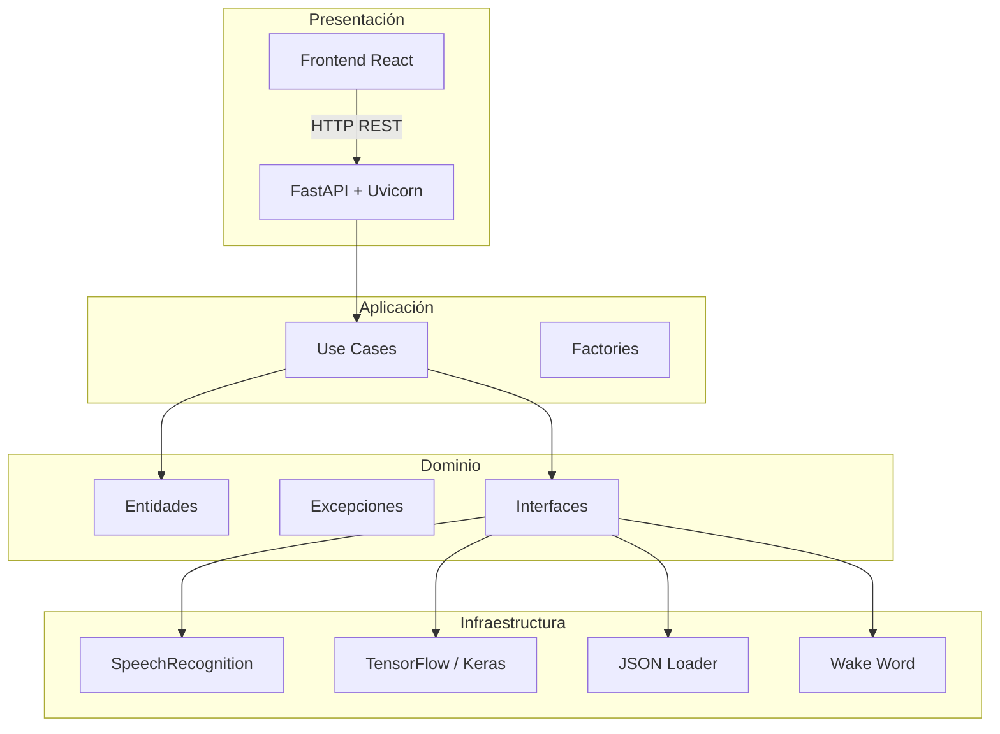
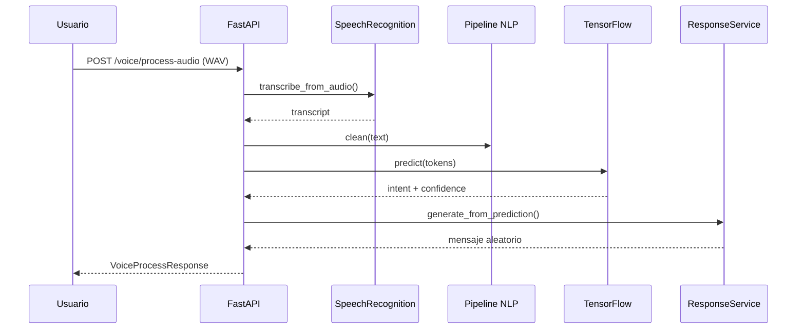
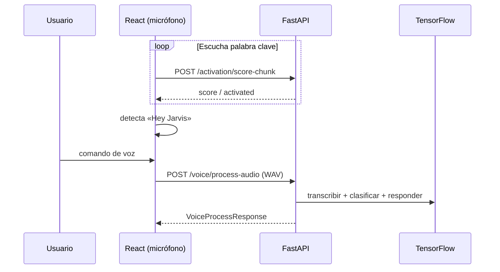

# Asistente de Voz

[](https://www.python.org/)
[](https://fastapi.tiangolo.com/)
[](https://www.tensorflow.org/)
[](https://react.dev/)
[](https://www.docker.com/)

API REST y frontend para un **asistente de voz en español** con reconocimiento de voz, clasificación de intenciones mediante **TensorFlow**, respuestas dinámicas desde JSON y activación opcional por palabra clave (*"oye sistema"*).

Diseñado con **arquitectura limpia**, despliegue en **Render** vía Docker y sin base de datos externa.

---

## Tabla de contenidos

- [Características](#características)
- [Arquitectura](#arquitectura)
- [Tecnologías](#tecnologías)
- [Estructura del proyecto](#estructura-del-proyecto)
- [Instalación](#instalación)
- [Uso rápido](#uso-rápido)
- [Endpoints de la API](#endpoints-de-la-api)
- [Modelo TensorFlow](#modelo-tensorflow)
- [Flujo de voz](#flujo-de-voz)
- [Buenas prácticas](#buenas-prácticas-implementadas)
- [Despliegue](#despliegue)
- [Tests](#tests)
- [Variables de entorno](#variables-de-entorno)
- [Documentación adicional](#documentación-adicional)

---

## Características

| Módulo | Descripción |
|--------|-------------|
| **Reconocimiento de voz** | SpeechRecognition (Google) — texto, WAV y micrófono local |
| **Clasificación de intenciones** | Red neuronal Keras entrenada con dataset JSON |
| **Respuestas inteligentes** | Variantes aleatorias por intención desde `responses.json` |
| **Wake word** | openWakeWord / Porcupine — solo entorno local |
| **Frontend** | React + Vite + Tailwind — grabación WAV y envío a la API |
| **Producción** | Docker multi-stage, healthcheck, logs JSON, Render Blueprint |

**Intenciones soportadas:** `saludo`, `hora`, `abrir_youtube`, `abrir_google`, `clima`, `despedida`, `musica`, `buscar_web` (+ fallback `desconocido`).

---

## Arquitectura

El proyecto sigue **Clean Architecture** en cuatro capas. La lógica de negocio no depende de FastAPI, TensorFlow ni SpeechRecognition.



### Capas

| Capa | Ruta | Responsabilidad |
|------|------|-----------------|
| **API** | `src/asistente_voz/api/` | Routers, dependencias, esquemas Pydantic |
| **Application** | `application/` | Casos de uso, factories, interfaces |
| **Domain** | `domain/` | Entidades, excepciones de dominio |
| **Infrastructure** | `infrastructure/` | TensorFlow, voz, respuestas, wake word |
| **Core** | `core/` | Config, logging, middleware, lifespan |

Documentación ampliada: [`docs/ARCHITECTURE.md`](docs/ARCHITECTURE.md)

---

## Tecnologías

### Backend

| Tecnología | Uso |
|------------|-----|
| **Python 3.12+** | Runtime principal |
| **FastAPI** | API REST, validación, OpenAPI |
| **Uvicorn** | Servidor ASGI |
| **Pydantic Settings** | Configuración por entorno |
| **TensorFlow / Keras** | Clasificador de intenciones |
| **spaCy** | Limpieza y normalización de texto (`es_core_news_sm`) |
| **SpeechRecognition** | Transcripción de voz (es-ES) |
| **openWakeWord / Porcupine** | Detección de palabra clave (local) |

### Frontend

| Tecnología | Uso |
|------------|-----|
| **React 19** | Interfaz de usuario |
| **Vite 6** | Bundler y dev server |
| **TypeScript** | Tipado estático |
| **Tailwind CSS** | Estilos |
| **openWakeWord (API)** | Wake word «Hey Jarvis»: micrófono en el navegador, detección en el servidor |

### DevOps

| Tecnología | Uso |
|------------|-----|
| **Docker** | Imagen multi-stage con entrenamiento en build |
| **docker-compose** | Entorno local tipo producción |
| **Render** | Hosting (Blueprint `render.yaml`) |
| **pytest / ruff** | Tests y linting |

---

## Estructura del proyecto

```
Asistente de voz/
├── src/asistente_voz/          # Código fuente del backend
│   ├── api/                    # Capa HTTP (v1, endpoints, dependencies)
│   ├── application/            # Casos de uso, factories, interfaces
│   ├── domain/                 # Entidades y excepciones
│   ├── infrastructure/         # TensorFlow, voz, respuestas, wake word
│   ├── core/                   # App factory, config, logging, middleware
│   ├── schemas/                # DTOs Pydantic
│   └── main.py                 # Punto de entrada
├── frontend/                   # Cliente React (Vite)
├── data/
│   ├── intents/                # Dataset de entrenamiento
│   └── responses/              # Catálogo de respuestas
├── models/
│   ├── tensorflow/             # Artefactos ML (.keras, tokenizer, labels)
│   └── wakeword/               # Modelos ONNX / Porcupine (local)
├── scripts/
│   ├── train_intent_model.py   # Entrenamiento CLI
│   └── docker-entrypoint.sh    # Arranque en contenedor
├── tests/                      # Tests unitarios e integración
├── Dockerfile                  # Build multi-stage (incluye entrenamiento)
├── docker-compose.yml
├── render.yaml                 # Blueprint Render
├── .env.example
├── .env.production.example
├── DEPLOY.md                   # Guía de despliegue detallada
└── docs/
    ├── ARCHITECTURE.md
    └── API.md
```

---

## Instalación

### Requisitos previos

- **Python 3.12** (recomendado) o 3.13
- **Node.js 20+** (frontend)
- Micrófono (opcional, para `/voice/listen` y wake word)
- ~2 GB de espacio libre (TensorFlow + spaCy)

### 1. Clonar el repositorio

```bash
git clone https://github.com/TU_USUARIO/asistente-de-voz.git
cd asistente-de-voz
```

### 2. Backend

```powershell
# Windows (PowerShell)
python -m venv .venv
.\.venv\Scripts\Activate.ps1
pip install -r requirements.txt
python -m spacy download es_core_news_sm

copy .env.example .env
$env:PYTHONPATH = "src"

# Entrenar el modelo (obligatorio antes de usar /intents o /voice)
python scripts/train_intent_model.py

# Arrancar API
uvicorn asistente_voz.main:app --reload --host 0.0.0.0 --port 8000
```

```bash
# Linux / macOS
python3 -m venv .venv
source .venv/bin/activate
pip install -r requirements.txt
python -m spacy download es_core_news_sm

cp .env.example .env
export PYTHONPATH=src
python scripts/train_intent_model.py
uvicorn asistente_voz.main:app --reload --host 0.0.0.0 --port 8000
```

### 3. Frontend

```bash
cd frontend
npm install
cp .env.example .env
npm run dev
```

Abre [http://localhost:5173](http://localhost:5173). El proxy de Vite redirige `/api` al backend en el puerto `8000`.

**Activación por voz («Hey Jarvis»):** en el panel *Palabra clave*, activa *Wake word ON*. El navegador captura audio en fragmentos y el backend los analiza con openWakeWord (`hey_jarvis_v0.1.onnx`). Al detectar la frase, graba tu comando (~10 s) y lo envía a la API. Requiere en `.env` del backend: `WAKEWORD_ENABLED=true`, `WAKEWORD_PHRASE=hey jarvis` y el modelo descargado (`python scripts/download_wakeword_model.py`).

### 4. Verificar instalación

```bash
curl http://localhost:8000/api/v1/health
```

Con documentación habilitada (`ENABLE_DOCS=true`): [http://localhost:8000/docs](http://localhost:8000/docs)

---

## Uso rápido

**Procesar texto (sin audio):**

```bash
curl -X POST http://localhost:8000/api/v1/voice/process \
  -H "Content-Type: application/json" \
  -d "{\"text\": \"hola, qué tal\"}"
```

**Procesar archivo WAV:**

```bash
curl -X POST http://localhost:8000/api/v1/voice/process-audio \
  -F "audio=@comando.wav"
```

**Solo clasificar intención:**

```bash
curl -X POST http://localhost:8000/api/v1/intents/predict \
  -H "Content-Type: application/json" \
  -d "{\"text\": \"abre youtube\"}"
```

---

## Endpoints de la API

Prefijo base: **`/api/v1`**

| Método | Ruta | Descripción | Producción |
|--------|------|-------------|:----------:|
| `GET` | `/` | Información del servicio | Sí |
| `GET` | `/health` | Healthcheck (Render) | Sí |
| `POST` | `/intents/predict` | Clasificar intención | Sí |
| `GET` | `/intents/model/status` | Estado del modelo TF | Sí |
| `POST` | `/responses/generate` | Clasificar + respuesta | Sí |
| `GET` | `/responses/catalog` | Catálogo de intenciones | Sí |
| `GET` | `/responses/{intent}` | Respuesta aleatoria | Sí |
| `POST` | `/voice/process` | Texto → intención → respuesta | Sí |
| `POST` | `/voice/transcribe` | WAV → texto | Sí |
| `POST` | `/voice/process-audio` | WAV → flujo completo | Sí |
| `POST` | `/voice/listen` | Micrófono → flujo completo | Solo local |
| `GET` | `/activation/config` | Config wake word | Sí |
| `POST` | `/activation/listen` | Wake word + comando | Solo local |

Referencia completa con ejemplos de request/response: [`docs/API.md`](docs/API.md)

---

## Modelo TensorFlow

Clasificador **multiclase** de intenciones en español.

### Pipeline NLP

1. **TextCleaner** — normalización con spaCy (minúsculas, lematización, stopwords).
2. **TextVectorizer** — vocabulario con padding a longitud fija.
3. **LabelEncoder** — mapeo intención ↔ índice.

### Arquitectura Keras

```
Input (tokens) → Embedding → GlobalAveragePooling → Dense(64, ReLU) → Dropout(0.3) → Softmax
```

### Artefactos generados

| Archivo | Descripción |
|---------|-------------|
| `intent_classifier.keras` | Modelo entrenado |
| `tokenizer.json` | Vocabulario |
| `labels.json` | Etiquetas de clase |
| `training_metadata.json` | Métricas y metadatos |

### Entrenamiento

```bash
PYTHONPATH=src python scripts/train_intent_model.py
```

Variables relevantes: `TF_EPOCHS`, `TF_CONFIDENCE_THRESHOLD`, `TF_FALLBACK_INTENT`.  
En Docker/Render el modelo se entrena automáticamente durante el build.

Detalle técnico: [`docs/ARCHITECTURE.md#modelo-de-intenciones-tensorflow`](docs/ARCHITECTURE.md#modelo-de-intenciones-tensorflow)

---

## Flujo de voz

### Flujo principal (texto o audio)



### Flujo con wake word

**Navegador (recomendado en Render):** fragmentos de audio → `POST /activation/score-chunk` (openWakeWord) → al activar, grabación local → `POST /voice/process-audio`.

**Backend local (openWakeWord):** `POST /activation/listen` con modelo `hey_jarvis_v0.1.onnx` y frase `hey jarvis`.



En **producción** (Render) el micrófono del servidor no está disponible; usa el wake word del frontend o `/voice/process-audio` desde el botón de micrófono.

---

## Buenas prácticas implementadas

| Práctica | Implementación |
|----------|----------------|
| **Arquitectura limpia** | Capas separadas; dominio sin dependencias externas |
| **SOLID** | Interfaces (`ISpeechService`, `IResponseProvider`), factories por módulo |
| **Inyección de dependencias** | FastAPI `Depends` + factories en `api/dependencies.py` |
| **Configuración externa** | `pydantic-settings`, `.env`, sin valores hardcodeados |
| **Type hints** | Tipado en todo el backend Python |
| **Validación de entrada** | Pydantic en schemas; validador de audio WAV |
| **Manejo global de errores** | `core/errors/handlers.py` con respuestas JSON uniformes |
| **Logging estructurado** | JSON en producción; `request_id` en middleware |
| **Seguridad en producción** | Swagger deshabilitable; micrófono bloqueado en `APP_ENV=production` |
| **Healthcheck** | `/api/v1/health` para Docker y Render |
| **Tests** | pytest para API, ML, voz, respuestas y wake word |
| **Contenedor no root** | Usuario `app` en imagen Docker final |
| **Lazy loading ML** | Modelo cargado en lifespan al arrancar |

---

## Despliegue

### Render (recomendado)

1. Conecta el repositorio en [Render](https://render.com).
2. Crea un **Blueprint** desde `render.yaml`.
3. Configura `CORS_ORIGINS` con la URL de tu frontend.
4. El build entrena el modelo y despliega sin pasos manuales.

```bash
curl https://TU-SERVICIO.onrender.com/api/v1/health
```

### Docker local

```bash
cp .env.production.example .env.production
docker compose up --build
```

Guía completa: [`DEPLOY.md`](DEPLOY.md)

---

## Tests

```bash
# Desde la raíz del proyecto
$env:PYTHONPATH = "src"   # PowerShell
pytest tests/ -v
```

Requiere modelo entrenado para tests de integración de intents.

---

## Variables de entorno

Copia `.env.example` a `.env` para desarrollo o `.env.production.example` a `.env.production` para Docker.

| Variable | Descripción | Default |
|----------|-------------|---------|
| `APP_ENV` | `development` \| `staging` \| `production` | `development` |
| `DEBUG` | Modo debug | `false` |
| `API_PREFIX` | Prefijo de rutas | `/api/v1` |
| `ENABLE_DOCS` | Swagger/ReDoc | `true` |
| `HOST` / `PORT` | Servidor HTTP | `0.0.0.0` / `8000` |
| `CORS_ORIGINS` | Orígenes permitidos (coma) | localhost |
| `LOG_LEVEL` | Nivel de log | `INFO` |
| `LOG_FORMAT` | `json` \| `text` | `json` |
| `LOG_TO_FILE` | Escribir a archivo | `true` |
| `TF_CONFIDENCE_THRESHOLD` | Umbral de confianza | `0.75` |
| `WAKEWORD_ENABLED` | Activar wake word | `true` |
| `WAKEWORD_PHRASE` | Frase de activación | `oye sistema` |

Lista completa en [`.env.example`](.env.example).

---

## Documentación adicional

| Documento | Contenido |
|-----------|-----------|
| [`docs/ARCHITECTURE.md`](docs/ARCHITECTURE.md) | Arquitectura, capas, ML y flujos detallados |
| [`docs/API.md`](docs/API.md) | Referencia REST con ejemplos |
| [`DEPLOY.md`](DEPLOY.md) | Despliegue en Render y Docker |

---

## Licencia

Este proyecto es de uso educativo y demostrativo. Añade tu licencia preferida (`MIT`, `Apache-2.0`, etc.) según corresponda.
